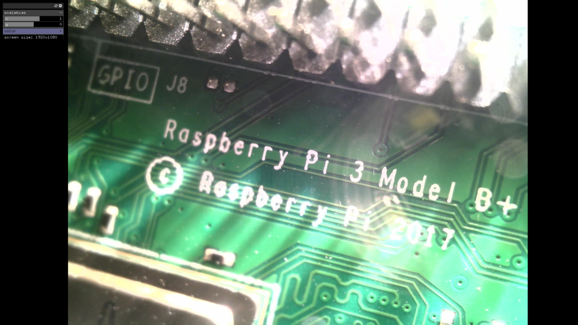

# About raspiCamGrab

### What??

raspiCamGrab is a program that displays the camera (namely a supereyes microscope) onto a screen.
The image is formatted so that it matches a A3 paper format.
It should match an A3 paper with a 24" display.

### Expected Behavior

The camera should just show up with the settings stored in `/bin/data/settings.xml`.
Press <kbd>h</kdb> to display/hide mouse and image adjustments (mouse control only).
Press <kbd>s</kdb> to save image adjustments in `/bin/data/settings.xml`.
Press <kbd>l</kdb> to (re)load image adjustments from `/bin/data/settings.xml`.
Press <kbd>s</kdb> to capture a snapshot in `/bin/data/screenshot.png`
Press <kbd>Esc</kdb> to exit.

### Other classes used in this file

This example uses no other classes.

### Hiding boot sequence
There are various recommandations for hiding the boot sequence. Here's what worked for me, by editing the file /boot/cmdline.txt on a raspberry Pi 3 Model B+, running raspbian stretch :

sudo nano /boot/cmdline.txt
then **remove** `console=tty1` (setting it to tty3, as recommanded by some didn't work here) and add `logo.nologo quiet` at the end.

Beware that incorrect syntax might result in boot failure!

Also, if not starting X11, the above doesn't yield a login prompt in tty1. A workaround is to switch to another console with the command <kbd>alt</kdb>+<kbd>shift</kdb>+<kbd>F2</kdb>, then back to tty1 with <kbd>alt</kdb>+<kbd>shift</kdb>+<kbd>F1</kdb>.
